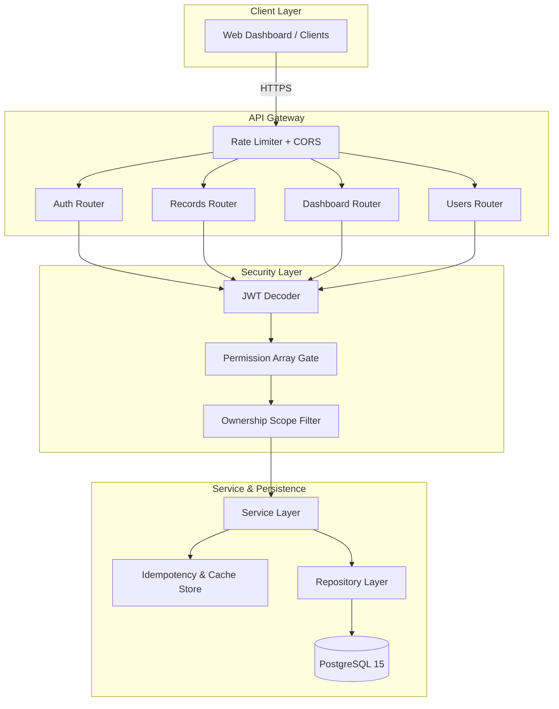
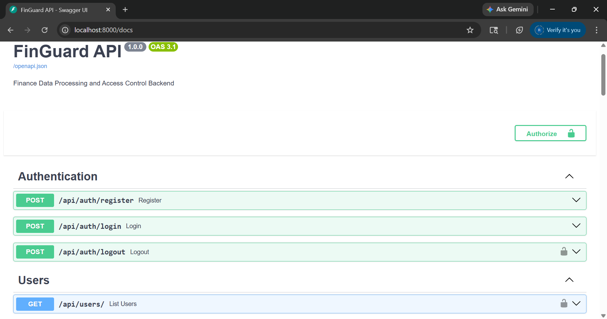
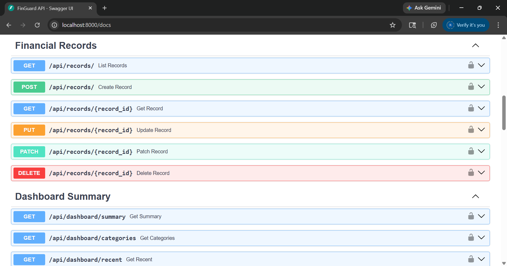
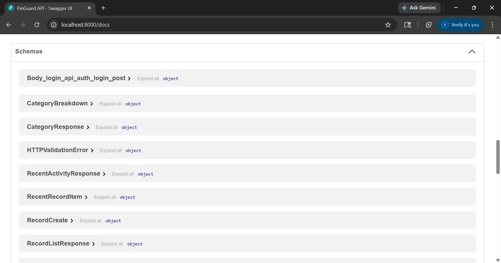

# FinGuard — Resilient Finance Data Processing Layer

This is not a traditional CRUD application. FinGuard is a backend architecture designed around scale, idempotency, and failure isolation. It demonstrates system-design thinking under simulated enterprise constraints.

> [!IMPORTANT]
> **System Design & Engineering Signal (30-Second TL;DR)**
> * **Scale Awareness:** At 100k users, dashboard `SUM/GROUP BY` aggregations bottleneck the DB. **Fix:** Implemented a composite index `(created_by, date)` and a **Synchronous Cache-Aside Pattern** to reduce DB load by 99%.
> * **Failure Handling:** Network drops cause client retries leading to double-charges. **Fix:** Intercepted write operations via an **Idempotency-Key Gateway** mapping to an in-memory TTL dictionary.
> * **Trade-Offs:** Chose strict **PostgreSQL ACID compliance** over eventual consistency; utilized **Permission Arrays** over rigid 'role' strings to dynamically mirror AWS IAM patterns without rewriting backend logic.

---

## Engineering Mindset: Designing for Failure & Scale

When interviewing for backend roles, the implementation details matter less than *why* they were chosen. This project is built around anticipating system breaking points.

### The Scale Narrative: What Breaks at 100k Users?
If this application hits 100,000 active users and millions of financial records, the immediate failure point is the **dashboard aggregation queries**.
*   **The Problem**: Running `SUM()`, `COUNT()`, and `GROUP BY` across millions of rows causes CPU exhaustion and database lock contention.
*   **The Fix**: I implemented an aggressive **Cache-Aside Pattern** alongside **Composite Grouping Indexes**. The heavy DB queries execute exactly once per hour per user. Subsequent dashboard requests bypass the database entirely, shifting the bottleneck from DB CPU to fast memory access.

### Failure Handling & Idempotency
Network retries are inevitable. If a client connection drops during a transaction, they will retry.
*   **The Problem (Duplicate Writes)**: If a user clicks "Submit" twice due to a laggy connection, they risk double-charging their financial ledger.
*   **The Fix**: The API gateway intercepts all write operations explicitly requiring an `Idempotency-Key` header. Duplicate requests fetch the finalized response from an in-memory cache directly, ensuring a mutated transaction resolves exactly once.

---

## Architectural Trade-Offs (The "Big Three")

Every technical decision in this project was weighed against constraints. Here is the reasoning:

1. **Why PostgreSQL over SQLite or Document Stores?**
   Financial ledgers strictly demand ACID compliance. Eventual consistency causes fatal race conditions, and file-level locking causes read/write contention. PostgreSQL, managed by `Alembic` schema migrations, guarantees row-level transactional integrity.

2. **Why a Synchronous Cache-Aside Pattern?**
   In a massive enterprise ecosystem, invalidations happen asynchronously via RabbitMQ or Kafka. However, within the scope of this assignment, introducing event queues is over-engineering. I built an in-memory TTL dictionary that mimics a Redis client (`.get`, `.set`, `.invalidate`). Migrating this to a distributed AWS ElastiCache cluster requires changing one file, without modifying the router or service layers.

3. **Why Permission Arrays over Hardcoded Role Enums?**
   Routing logic checking `if user.role == "admin"` creates technical debt. Instead, I injected permission arrays (e.g., `["records:write"]`). If a new "Auditor" role is required tomorrow, no API logic gets rewritten; we simply append the new role to the database array, dynamically mirroring enterprise IAM models.

---

## Core Security & Data Isolation Model

FinGuard enforces multi-tenant data isolation directly at the database repository layer, mitigating IDOR (Insecure Direct Object Reference) attacks structurally. 

*   **Ownership Filtering**: Every database query accepts an optional `user_id` scope. Non-admin queries inject the caller's UUID into the `WHERE` clause.
*   **Data Leakage Prevention**: If a user attempts to fetch a valid record that belongs to another person, the backend returns a `404 Not Found` (rather than a `403 Forbidden`). This prevents an attacker from extracting metadata regarding the existence of private entities.

---

## Project Structure & Architecture



**Stack:** Python 3.12 | FastAPI | SQLAlchemy | PostgreSQL | Docker | Pytest

---

## Fast-Track Setup Instructions

**Prerequisites:** Docker, Python 3.12

### 1. Launch & Bootstrap
Run the Docker daemon to initialize the isolated PostgreSQL container.
```bash
docker compose up -d
```

### 2. Virtual Environment Setup

**Mac/Linux:**
```bash
python -m venv venv
source venv/bin/activate
pip install -r requirements.txt
cp .env.example .env
```

**Windows (PowerShell):**
```powershell
python -m venv venv
.\venv\Scripts\Activate.ps1
pip install -r requirements.txt
copy .env.example .env
```

### 3. Migrations & Seed Data
Initialize `Alembic` constraints and seed randomized financial data across multiple role boundaries.
```bash
python scripts/seed.py
```
> **Seeded Test Accounts**:
> * **Admin**: `admin@finance.dev` | `Admin@123` (Full analytical & write scopes)
> * **Analyst**: `analyst@finance.dev` | `Analyst@123` (Read-only + Analytical scopes)
> * **Viewer**: `viewer@finance.dev` | `Viewer@123` (Read-only basic scopes)

### 4. Execute Backend
```bash
# Mac/Linux
uvicorn app.main:app --reload

# Windows (if global uvicorn fails, execute relative to venv)
.\venv\Scripts\uvicorn.exe app.main:app --reload
```
Navigate natively to **`http://localhost:8000/docs`** to explore the Swagger UI endpoints.
 
### API Documentation Preview (Swagger UI)
 
| **API Overview** | **Endpoint Details** | **Response Schema** |
|:---:|:---:|:---:|
|  |  |  |

### How to demo fast (reviewer path)
1. `docker compose up -d` (API + Postgres)
2. `python scripts/seed.py` (creates admin/viewer/analyst)
3. Open `http://localhost:8000/docs` and call **POST /api/records** with header `Idempotency-Key: <uuid>` then view **GET /api/dashboard/summary** to see cached aggregation.

### What to review first
1. `app/services/record_service.py` for ownership scope and business flow.
2. `app/repositories/record_repository.py` for SQL-level aggregation, soft-delete filtering, and audits.
3. `tests/integration/test_api.py` for RBAC, idempotency replay, and IDOR protection checks.

### Dev commands
```bash
make dev
make test
make seed
make perf-smoke
```
If `make` is unavailable (common on Windows), use:
```powershell
python -m uvicorn app.main:app --reload
python -m pytest tests/ -v
python scripts/seed.py
python scripts/perf_smoke.py --rows 100000 --target-ms 150
```

---

## Test Suite Execution

The Pytest suite intercepts dependency injection, substituting the PostgreSQL gateway with an ephemeral `SQLite :memory:` node, and dynamically validates the ownership security boundaries.

```bash
python -m pytest tests/ -v
```

All integration testing enforces strict checks against:
- Data Scoping and Multi-tenant boundaries.
- Cache Invalidation verification.
- Idempotency validations for network retry paths.
