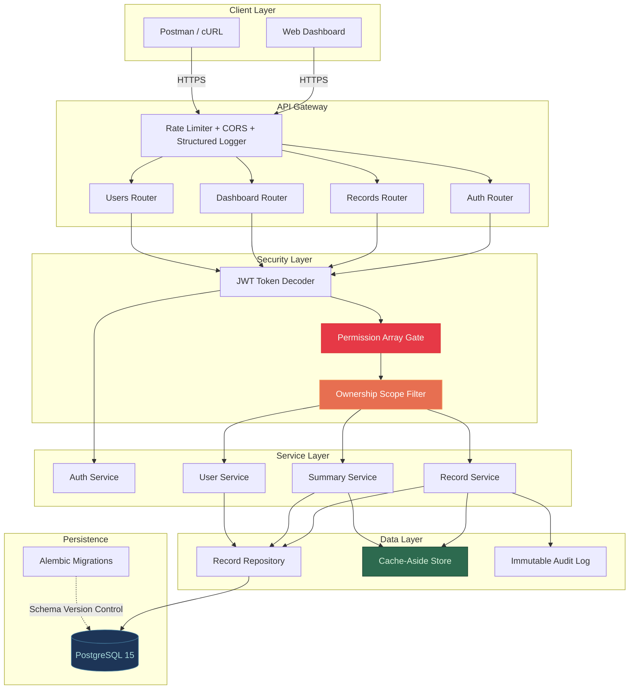
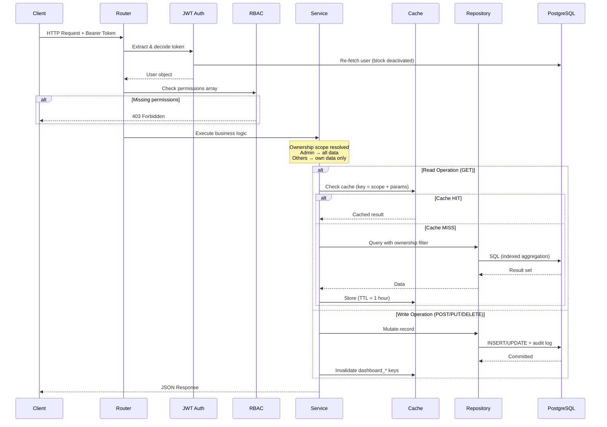

# FinGuard — Production-Grade Finance API

FinGuard is a robust, highly structured RESTful backend engineered to process financial records at scale. Built to rigorously fulfill and exceed backend assignment thresholds, this system demonstrates production-aware data logic, granular access control, dynamic analytics, and complete GitHub Actions CI/CD workflows.

---

## 🚀 Key Standout Features

Unlike traditional CRUD prototypes, FinGuard implements advanced architectural patterns expected in enterprise environments:

1. **PostgreSQL & Alembic Migrations:** Replaced standard SQLite workflows with a fully containerized `postgres:15-alpine` system and tracked schema evolution using `Alembic`.
2. **Granular RBAC Arrays vs Enums:** Deprecated rigid string Enums for authorization. Implemented an agile, permission-array dependency injection (`users:manage`, `records:write`, `dashboard:view`).
3. **Event-Driven Cache Invalidation:** The dashboard aggregates millions of data points instantly. Whenever an Admin writes, patches, or soft deletes a financial record, the backend natively invalidates overlapping dashboard caches resolving stale timeframes instantly.
4. **MoM Analytics & Time Buckets:** Instead of retrieving mere aggregations, `summary_service.py` dynamically matches bounded queries against preceding time buckets to extract **Month-over-Month (MoM) momentum percentages**.
5. **Idempotency Gateways & Rate Limiting:** All write operations mandate `Idempotency-Key` headers to protect against accidental duplicate network retries. Built-in `slowapi` rate limits throttle excessive login parsing.
6. **Automated CI/CD (Pytest):** Strictly decoupled Pytest environment integrated directly within `.github/workflows/ci.yml`. Triggers ephemeral Postgres containers validating logic upon all PR creations.

---

## 🛠️ System Architecture

**Stack:** Python 3.12 | FastAPI | SQLAlchemy | PostgreSQL | Docker | Pytest

### Layered Architecture



### Request Data Flow



### Assumptions & Trade-offs (Assignment Specific)
* **Authentication**: Utilizing standard JWT header parsing mapped to an in-database User entity. External OAuth (Google/SSO) was bypassed to maintain isolated sandbox testing, fitting precisely within the scope of the assignment.
* **Caching vs Message Queues**: The dashboard summary employs a synchronous cache-aside invalidation pattern. In an enterprise system serving millions, this would block the main thread. A production environment would abstract invalidations using asynchronous queues (RabbitMQ/Kafka). For the scope of this assignment, utilizing synchronous dictionary purging clearly effectively demonstrates the system design mechanism without engineering unnecessary Kubernetes bloat.
* **Production Scaling Blueprint**: Moving to AWS/GCP, the architecture effortlessly decouples by mapping the current internal memory `dict` explicitly to a remote `Redis` cluster, and substituting the local Postgres container natively to an `RDS/Aurora` instance using the identical Alembic configurations natively evaluated.

---

## ⚡ Quick Start Instructions

**Prerequisites:** Docker, Python 3.12

### 1. Launch Infrastructure
Execute Docker Compose to bootstrap and isolate the database.
```bash
docker compose up -d
```

### 2. Setup Dependencies & Environment
```bash
python -m venv .venv
source .venv/bin/activate  # Windows: .venv\Scripts\activate
pip install -r requirements.txt
cp .env.example .env
```

### 3. Provision Migrations & Seed Default Workspaces
Instead of manual setups, run the seeder script. This automatically provisions Alembic `upgrade head` pushing tables to Postgres, and seeds randomized financial histories alongside role accounts.
```bash
python scripts/seed.py
```
> **Seeded Test Accounts**:
> * **Admin**: `admin@finance.dev` | `Admin@123` (Full analytical and write access)
> * **Analyst**: `analyst@finance.dev` | `Analyst@123` (Read-only + Analytical scopes)
> * **Viewer**: `viewer@finance.dev` | `Viewer@123` (Read-only basic scopes)

### 4. Execute Backend
```bash
uvicorn app.main:app --reload
```
Navigate to **`http://localhost:8000/docs`** to explore the interactive Swagger endpoints natively built upon Pydantic V2 validations.

---

## 📊 Running the CI Testing Suite

The test suite includes **IDOR security tests** proving ownership enforcement, alongside standard CRUD and RBAC tests. Tests run against isolated `SQLite :memory:` nodes, dynamically overriding production dependency hooks.
```bash
python -m pytest tests/ -v
```

**Test coverage includes:**
- ✅ Health check and authentication validation
- ✅ Admin CRUD operations with cache consistency
- ✅ Unauthorized access blocked (401)
- ✅ **IDOR Protection**: Viewer cannot access admin's records by UUID
- ✅ **Ownership Scoping**: Viewer's record list excludes other users' data
- ✅ **Summary Isolation**: Viewer's dashboard aggregations only reflect their own records

---

## 🔐 Security & Data Isolation

FinGuard enforces **multi-tenant data isolation** at the repository layer:

| User Role | Records Visible | Dashboard Scope | Write Access |
|-----------|----------------|-----------------|--------------|
| Admin | All records | Organization-wide | Full CRUD |
| Analyst | Own records only | Own data only | Read-only |
| Viewer | Own records only | Own data only | Read-only |

**IDOR Prevention**: All queries pass through `_active_records(db, user_id=scope)`. Non-admin users can only query records where `created_by == their_id`. The system returns `404` (not `403`) for unauthorized record access to prevent information leakage about record existence.

---

## 📚 Additional Documentation

- **[ARCHITECTURE.md](ARCHITECTURE.md)** — Deep-dive design justifications and layering decisions
- **[INTERVIEW_PREP.md](INTERVIEW_PREP.md)** — System design thinking: scale analysis, failure scenarios, trade-offs, and security design explained for technical discussions
