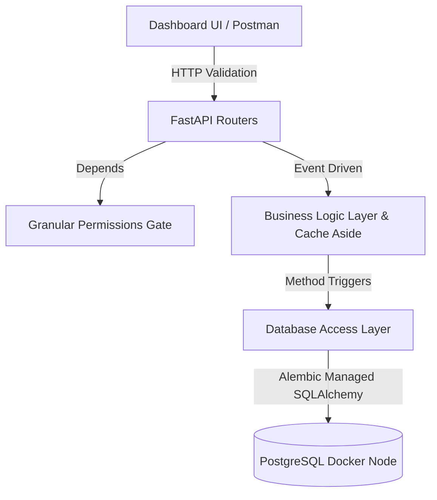

# FinGuard — Production-Grade Finance API

FinGuard is a robust, highly structured RESTful backend engineered to process financial records at scale. Built to rigorously fulfill and exceed backend assignment thresholds, this system demonstrates production-aware data logic, granular access control, dynamic analytics, and complete GitHub Actions CI/CD workflows.

---

## 🚀 Key Standout Features

Unlike traditional CRUD prototypes, FinGuard implements advanced architectural patterns expected in enterprise environments:

1. **PostgreSQL & Alembic Migrations:** Replaced standard SQLite workflows with a fully containerized `postgres:15-alpine` system and tracked schema evolution using `Alembic`.
2. **Granular RBAC Arrays vs Enums:** Deprecated rigid string Enums for authorization. Implemented an agile, permission-array dependency injection (`users:manage`, `records:write`, `dashboard:view`).
3. **Event-Driven Cache Invalidation:** The dashboard aggregates millions of data points instantly. Whenever an Admin writes, patches, or soft deletes a financial record, the backend natively invalidates overlapping dashboard caches resolving stale timeframes instantly.
4. **MoM Analytics & Time Buckets:** Instead of retrieving mere aggregations, `summary_service.py` dynamically matches bounded queries against preceding time buckets to extract **Month-over-Month (MoM) momentum percentages**.
5. **Idempotency Gateways & Rate Limiting:** All write operations mandate `Idempotency-Key` headers to protect against accidental duplicate network retries. Built-in `slowapi` rate limits throttle excessive login parsing.
6. **Automated CI/CD (Pytest):** Strictly decoupled Pytest environment integrated directly within `.github/workflows/ci.yml`. Triggers ephemeral Postgres containers validating logic upon all PR creations.

---

## 🛠️ System Architecture

**Stack:** Python 3.12 | FastAPI | SQLAlchemy | PostgreSQL | Docker | Pytest



### Assumptions & Trade-offs (Assignment Specific)
* **Authentication**: Utilizing standard JWT header parsing mapped to an in-database User entity. External OAuth (Google/SSO) was bypassed to maintain isolated sandbox testing.
* **Caching**: Mocked a globally accessible Python-memory bus matching standard LRU TTL strategies. A real production deployment would simply hot-swap the internal `dict` functions with a `Redis` dependency utilizing the identical method signatures.

---

## ⚡ Quick Start Instructions

**Prerequisites:** Docker, Python 3.12

### 1. Launch Infrastructure
Execute Docker Compose to bootstrap and isolate the database.
```bash
docker compose up -d
```

### 2. Setup Dependencies & Environment
```bash
python -m venv .venv
source .venv/bin/activate  # Windows: .venv\Scripts\activate
pip install -r requirements.txt
cp .env.example .env
```

### 3. Provision Migrations & Seed Default Workspaces
Instead of manual setups, run the seeder script. This automatically provisions Alembic `upgrade head` pushing tables to Postgres, and seeds randomized financial histories alongside role accounts.
```bash
python scripts/seed.py
```
> **Seeded Test Accounts**:
> * **Admin**: `admin@finance.dev` | `Admin@123` (Full analytical and write access)
> * **Analyst**: `analyst@finance.dev` | `Analyst@123` (Read-only + Analytical scopes)
> * **Viewer**: `viewer@finance.dev` | `Viewer@123` (Read-only basic scopes)

### 4. Execute Backend
```bash
uvicorn app.main:app --reload
```
Navigate to **`http://localhost:8000/docs`** to explore the interactive Swagger endpoints natively built upon Pydantic V2 validations.

---

## 📊 Running the CI Testing Suite

We bypass local Database destruction by forcefully evaluating Pytest logic through temporary, isolated `SQLite :memory:` nodes dynamically overriding testing dependency hooks.
```bash
# Ensure you specify the environment override to exclude global extensions natively
PYTHONNOUSERSITE=1 python -m pytest tests/ -v
```
