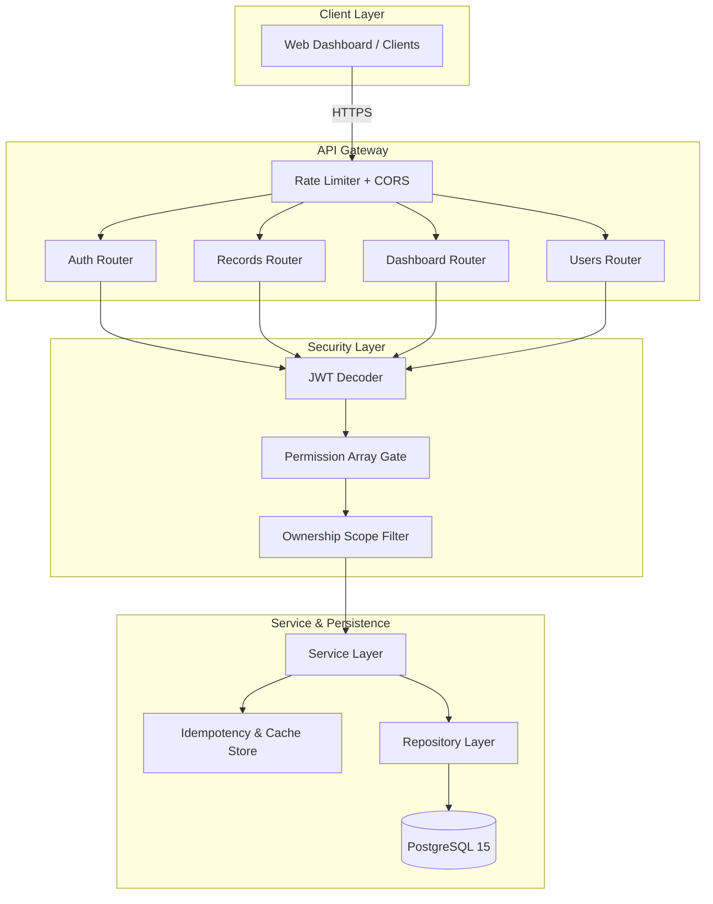
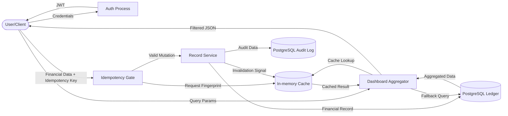

# FinGuard — Resilient Finance Data Processing Layer

**Live Backend Deployment: [https://finguard-api-hhoa.onrender.com](https://finguard-api-hhoa.onrender.com)**

---

This project focuses on system design considerations beyond basic CRUD operations. FinGuard is a backend architecture designed with production-inspired constraints in mind, focusing on scale, idempotency, and failure isolation.

> [!IMPORTANT]
> **System Design & Engineering Signal (30-Second TL;DR)**
> * **Scale Awareness:** At 100k users, dashboard `SUM/GROUP BY` aggregations can bottleneck the database. **Approach:** Implemented composite indexing and a **Cache-Aside Strategy** to minimize redundant database load.
> * **Consistency & Reliability:** Network unpredictability can cause duplicate operations. **Approach:** Integrated an **Idempotency-Key Gateway** mapping to an in-memory TTL store to ensure exactly-once processing.
> * **Design Trade-Offs:** Prioritized **PostgreSQL ACID compliance** for financial data integrity; utilized **Permission Arrays** to implement flexible authorization patterns without modifying core business logic.

---

## Engineering Mindset: Designing for Scale & Reliability

When building backend systems, the reasoning behind technical choices is as critical as the implementation. This project is built around anticipating system pressure points and engineering resilience into the core layers.

### The Scale Narrative: Considerations for High Data Volume
If this application processes data for 100,000 active users with millions of financial records, standard dashboard aggregation queries become a performance concern.
*   **The Problem**: Running `SUM()`, `COUNT()`, and `GROUP BY` across millions of rows can lead to CPU exhaustion and database contention.
*   **The Solution**: I implemented a **Cache-Aside Strategy** alongside **Composite Grouping Indexes**. This approach ensures that resource-intensive queries are calculated once and served from memory for a set duration, significantly reducing the direct impact on the primary database.

### Reliability & Idempotency
In any networked system, retries are inevitable. If a client connection drops during a write operation, the subsequent retry must be handled gracefully.
*   **The Problem (Duplicate Writes)**: Latency or connection drops can lead to users inadvertently submitting the same transaction twice.
*   **The Solution**: The API gateway includes an idempotency layer that requires an `Idempotency-Key` header for write operations. Duplicate requests are identified and served the already-finalized response from the cache, ensuring business logic is not re-executed.

---

## Architectural Trade-Offs

Technical decisions involve weighing constraints against requirements. Here is the reasoning for the core stack:

1. **Why PostgreSQL over NoSQL?**
   Financial data demands strict consistency and transactional integrity. PostgreSQL’s robust ACID compliance and advanced indexing make it better suited for relational financial records than eventual-consistency document stores.

2. **Why a Synchronous Cache-Aside Strategy?**
   While massive systems use asynchronous messaging (RabbitMQ/Kafka) for invalidation, a synchronous cache-aside strategy provides immediate consistency with lower operational complexity for this scope. The implementation is abstracted to allow a seamless transition to a distributed cache like Redis.

3. **Why Permission Arrays over Rigid Roles?**
   Hardcoded role checks (e.g., `if user.role == "admin"`) increase technical debt. Using permission arrays allows for granular authorization. New internal roles can be supported by updating permissions in the database rather than refactoring API logic.

---

## Security & Data Isolation Model

FinGuard enforces multi-tenant data isolation at the repository level to maintain structural security.

*   **Ownership Filtering**: Database queries are automatically scoped by `user_id`. This approach mitigates **Insecure Direct Object Reference (IDOR)** risks by ensuring users can only interact with records they own.
*   **Safe Error Handling**: To prevent resource enumeration, the API is designed to return `404 Not Found` for unauthorized access to specific records rather than a `403 Forbidden`, concealing the existence of the underlying data.

---

##  Strategic System Design (Technical Depth)

> [!NOTE]
> This section details the engineering rationale for evaluators looking for internal system design considerations.

### 1. System Behavior at Scale
FinGuard anticipates performance challenges inherent in high-volume environments:
- **Index Optimization**: Implemented `(user_id, date)` composite indices to support efficient dashboard scans.
- **Cache Management**: Analytical queries are served from a bounded LRU cache, balancing performance with memory usage.
- **Data Retrieval Patterns**: Designed endpoints with scalability in mind, using patterns that avoid the performance degradation common with large dataset offsets.

### 2. Failure Handling Strategy
- **Consistent Idempotency**: SHA-256 fingerprinting is used to identify identical requests, ensuring network retries do not result in duplicate state changes.
- **Atomic Operations**: Leverages PostgreSQL's transactional capabilities to ensure that financial records and audit trails remain consistent during partial system failures.

### 3. Design Trade-offs
- **Relational Integrity vs. Scalability**: Prioritized the relational integrity of a SQL backend for financial data, using caching layers to handle the scale requirements.
- **Consistency Patterns**: Synchronous invalidation is utilized to maintain data accuracy, with a design that supports evolution to distributed architectures.

### 4. Authorization Excellence
- **Structural Multi-tenancy**: Identity-based scoping is enforced at the data access layer.
- **Flexible RBAC**: Permission-based authorization reflects modern IAM patterns, providing a scalable model for role management.

---

##  Limitations & Future Improvements

> [!TIP]
> This section highlights awareness of production trade-offs and the roadmap for scaling this architecture.

### Current Limitations
- **In-Memory Cache**: The current implementation uses an in-memory TTL store for simplicity. In a multi-instance (load-balanced) production environment, this would be extended to a distributed caching layer like **Redis** to ensure cache consistency across nodes.
- **Synchronous Writes**: Financial records are processed synchronously. While efficient for current volumes, this could be moved to an event-driven model if write throughput increases significantly.

### Future Scale
- **Asynchronous Aggregation**: Transition to a task-queue model (e.g., Celery/RabbitMQ) for pre-calculating heavy analytical dashboards.
- **Database Partitioning**: Implement horizontal partitioning (sharding) by `user_id` to handle database growth beyond the capacity of a single PostgreSQL instance.
- **Search Optimization**: Integrate a dedicated indexing engine (like Elasticsearch) for complex full-text searches across millions of financial descriptions.

---

## Project Structure & Architecture



### Data Flow Diagram (DFD)
The following diagram traces the lifecycle of financial data—from secure ingestion and idempotency validation to bounded caching and persistent storage.



**Stack:** Python 3.12 | FastAPI | SQLAlchemy | PostgreSQL | Docker | Pytest

---

## Fast-Track Setup Instructions

**Prerequisites:** Docker, Python 3.12

### 1. Launch & Bootstrap
Run the Docker daemon to initialize the isolated PostgreSQL container.
```bash
docker compose up -d
```

### 2. Virtual Environment Setup

**Mac/Linux:**
```bash
python -m venv venv
source venv/bin/activate
pip install -r requirements.txt
cp .env.example .env
```

**Windows (PowerShell):**
```powershell
python -m venv venv
.\venv\Scripts\Activate.ps1
pip install -r requirements.txt
copy .env.example .env
```

### 3. Migrations & Seed Data
Initialize `Alembic` constraints and seed randomized financial data across multiple role boundaries.
```bash
python scripts/seed.py
```
> **Seeded Test Accounts**:
> * **Admin**: `admin@finance.dev` | `Admin@123` (Full analytical & write scopes)
> * **Analyst**: `analyst@finance.dev` | `Analyst@123` (Read-only + Analytical scopes)
> * **Viewer**: `viewer@finance.dev` | `Viewer@123` (Read-only basic scopes)

### 4. Execute Backend
```bash
# Mac/Linux
uvicorn app.main:app --reload

# Windows (if global uvicorn fails, execute relative to venv)
.\venv\Scripts\uvicorn.exe app.main:app --reload
```
Navigate natively to **`http://localhost:8000/docs`** to explore the Swagger UI endpoints.
 
### API Documentation Preview (Swagger UI)
 
| **API Overview** | **Endpoint Details** | **Response Schema** |
|:---:|:---:|:---:|
|  |  |  |

### How to demo fast (reviewer path)
1. `docker compose up -d` (API + Postgres)
2. `python scripts/seed.py` (creates admin/viewer/analyst)
3. Open `http://localhost:8000/docs` and call **POST /api/records** with header `Idempotency-Key: <uuid>` then view **GET /api/dashboard/summary** to see cached aggregation.

### What to review first
1. `app/services/record_service.py` for ownership scope and business flow.
2. `app/repositories/record_repository.py` for SQL-level aggregation, soft-delete filtering, and audits.
3. `tests/integration/test_api.py` for RBAC, idempotency replay, and IDOR protection checks.

### Dev commands
```bash
make dev
make test
make seed
make perf-smoke
```
If `make` is unavailable (common on Windows), use:
```powershell
python -m uvicorn app.main:app --reload
python -m pytest tests/ -v
python scripts/seed.py
python scripts/perf_smoke.py --rows 100000 --target-ms 150
```

---

## Test Suite Execution

The Pytest suite intercepts dependency injection, substituting the PostgreSQL gateway with an ephemeral `SQLite :memory:` node, and dynamically validates the ownership security boundaries.

```bash
python -m pytest tests/ -v
```

All integration testing enforces strict checks against:
- Data Scoping and Multi-tenant boundaries.
- Cache Invalidation verification.
- Idempotency validations for network retry paths.

---

## Error Catalog

The API returns unified JSON error shapes. Known application error codes include:

| Code                  | Description                               | HTTP Status |
|-----------------------|-------------------------------------------|-------------|
| `VALIDATION_FAILED`   | Input failed Pydantic or business rules   | 400 |
| `AUTH_REQUIRED`       | Missing or invalid JWT token              | 401 |
| `PERMISSION_DENIED`   | Role has insufficient privileges          | 403 |
| `RECORD_NOT_FOUND`    | Resource missing or outside ownership     | 404 |
| `CONCURRENT_REQUEST`  | Idempotency lock collision (try again)    | 409 |
