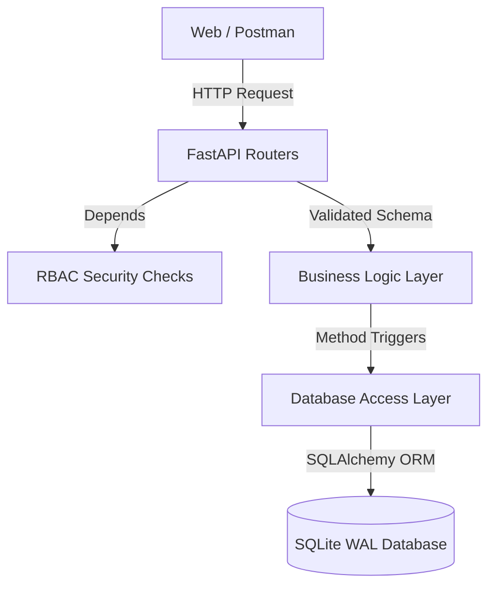

# FinGuard — Elite Finance Data Processing Backend

FinGuard is a production-grade RESTful API backend engineered to power a multi-role finance dashboard. The system manages organizational financial records, enforces strict Role-Based Access Control (RBAC), and computes powerful database-driven dashboard aggregations.

## 🚀 Key Differentiators & Elite Standards

Unlike boilerplate CRUD applications, FinGuard is built with severe architectural and security boundaries in mind:

- **Strict Boundary Layers:** Controllers (Routers) never evaluate raw SQL logic. Requests flow linearly: `Router -> Service Layer -> Repository Layer -> Database`.
- **RBAC Dependency Injection:** User permissions are enforced proactively before business logic handles memory using FastAPI's intuitive `Depends()` injection system.
- **Defensive API Gateways:** Credentials stuffing is actively thwarted utilizing `slowapi` rate limiting explicitly defined against login/registration pipeline boundaries.
- **Structured JSON Observability:** Overridden native stdout handling via global Middleware traces appending `uuid4` tracking per request instance.
- **SQL Aggregations vs N+1 Processing:** Time-bucketed dashboard metrics (`GetSummary`, `GetCategories`) evaluate directly inside the `SQLite` engine minimizing memory I/O and entirely avoiding python-space iterations over vast data records.

---

## 🏗️ System Architecture

FinGuard leverages a strictly typed **Python 3.12 + FastAPI + SQLAlchemy** stack. 



> **IMPORTANT:** For deep-dive design justifications and tradeoffs (Why FastAPI vs Django? Why SQLite WAL?), view the dedicated **[ARCHITECTURE.md](ARCHITECTURE.md)** document.

---

## 🛠️ Quick Start (Developer Setup)

### Prerequisites:
- Python 3.11+
- Git

### 1. Installation:
```bash
git clone https://github.com/Rajkaran-122/FinGuard.git
cd FinGuard
python -m venv venv
source venv/bin/activate  # Windows: venv\Scripts\activate
pip install -r requirements.txt
cp .env.example .env
```

### 2. Auto-Seeding Database:
Instead of jumping through manual REST POSTing to evaluate structural integrity, execute the built-in database seeder script. This instantly provisions an SQLite data volume complete with multi-role user accounts and 50 randomized financial records cleanly mapping backwards context.

```bash
python scripts/seed.py
```
> **Test Accounts Created Automatically:**
> - **Admin:** `admin@finance.dev` | `Admin@123`
> - **Analyst:** `analyst@finance.dev` | `Analyst@123` 
> - **Viewer:** `viewer@finance.dev` | `Viewer@123`

### 3. Execution:
```bash
uvicorn app.main:app --reload
```
View the generated **OpenAPI Swagger UI interface** dynamically hooked off model validation schemas directly at: `http://localhost:8000/docs`.

---

## 🔌 API Documentation & Usage Samples

Below are foundational examples demonstrating critical RESTful flows.

*(Note: The codebase contains an exportable `FinGuard_Postman_Collection.json`. Importing this natively configures authentication state arrays managing tokens dynamically alleviating manual evaluation friction).*

### 1. Authenticate (Login)
```bash
curl -X 'POST' \
  'http://localhost:8000/api/auth/login' \
  -H 'Content-Type: application/x-www-form-urlencoded' \
  -d 'username=admin@finance.dev&password=Admin@123'
```
*Response:*
```json
{
  "access_token": "eyJhbGciOiJIUzI1NiIsInR...",
  "token_type": "bearer"
}
```

### 2. Create a Financial Record (Admin Status Required)
*Requires Authorization Token.*
```bash
curl -X 'POST' \
  'http://localhost:8000/api/records/' \
  -H 'Authorization: Bearer <YOUR_ACCESS_TOKEN>' \
  -H 'Content-Type: application/json' \
  -d '{
  "amount": 2450.50,
  "type": "income",
  "category": "Consulting",
  "date": "2025-01-20",
  "notes": "Q1 Retainer"
}'
```

### 3. Fetch Dashboard Summary
Leverages raw database `SUM` aggregations instead of python array evaluation.
```bash
curl -X 'GET' \
  'http://localhost:8000/api/dashboard/summary' \
  -H 'Authorization: Bearer <YOUR_ACCESS_TOKEN>'
```
*Response:*
```json
{
  "total_income": 85000.0,
  "total_expenses": 32000.0,
  "net_balance": 53000.0,
  "record_count": 48
}
```

---

## 🧪 Validations & Dynamic Testing

A fully decoupled Pytest integration suite overrides dependency engines securely injecting in-memory unpersisted SQLite scopes per testing function. This ensures test reliability bypassing explicit environment tearing.

```bash
python -m pytest tests/ -v
```
